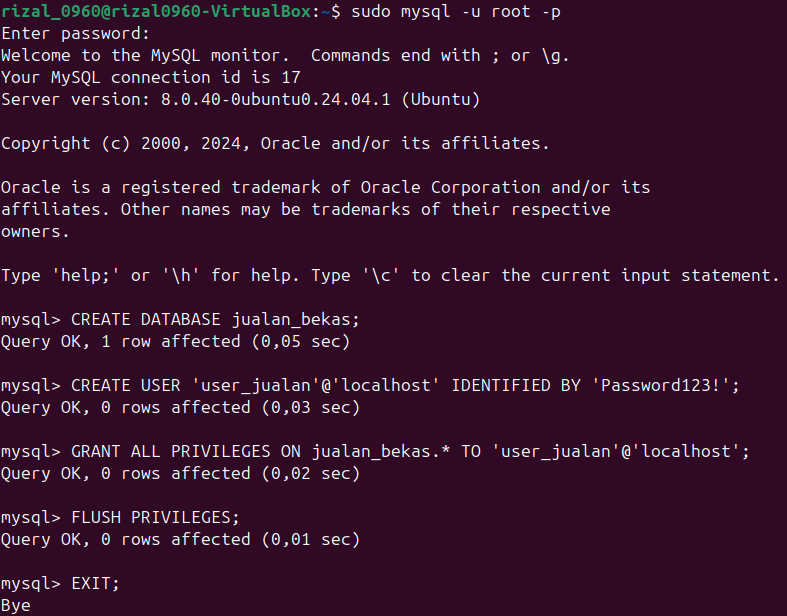
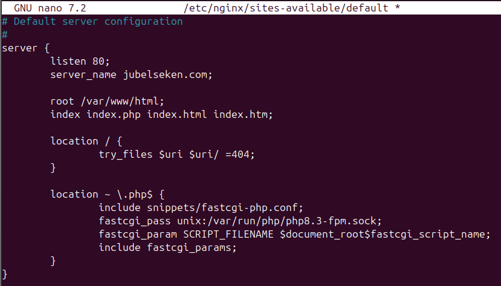
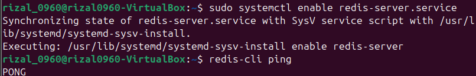
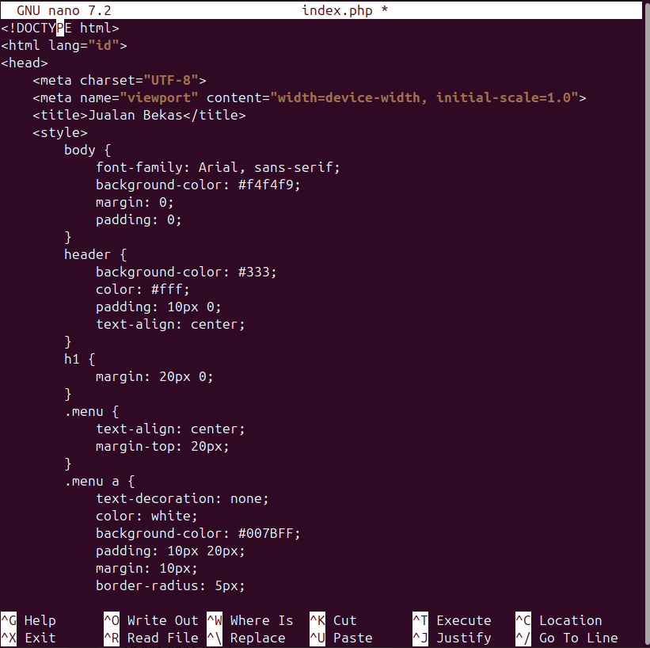
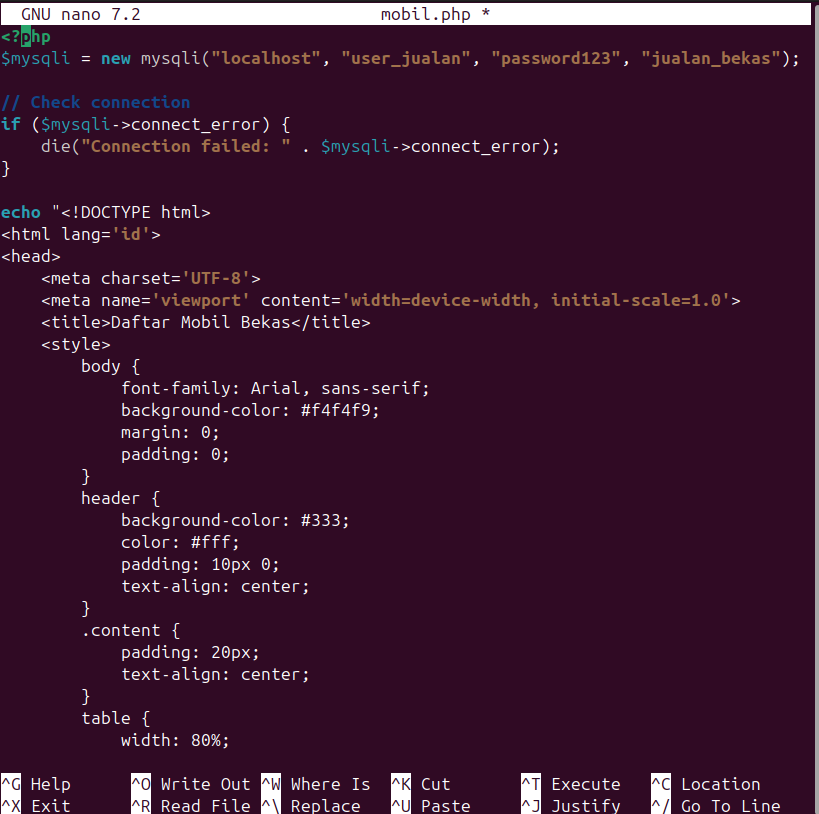
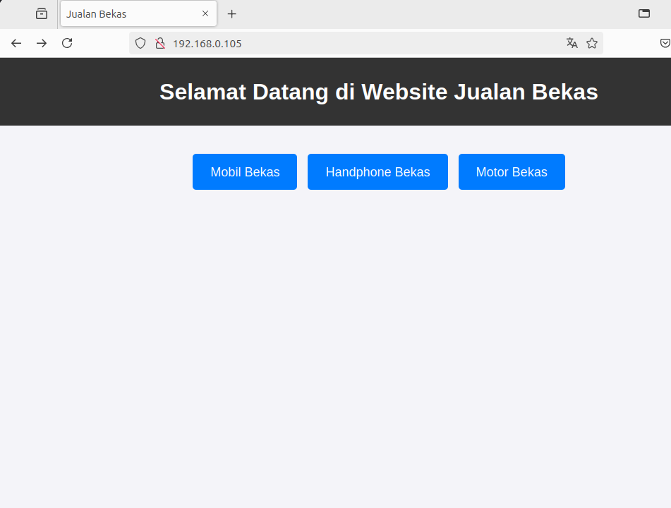
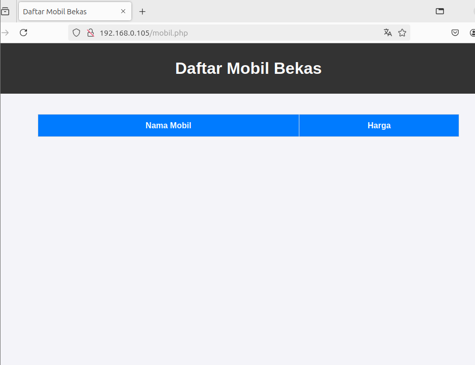

# FINAL PROJECT OS SERVER - 23.83.0960

Membuat Layanan Web Server di **Ubuntu Desktop 22.04.3** dengan spesifikasi berikut:
- **RAM**: 4 GB  
- **Processor**: 4 CPU  
- **Disk**: 32 GB

## Daftar Isi
1. [1. Nginx (Web Server)](#1-nginx-web-server)
2. [2. MySQL (Database Server)](#2-mysql-database-server)
3. [3. PHP (Backend Server)](#3-php-backend-server)
4. [4. Redis (Cache Server)](#4-redis-cache-server)
5. [5. OpenSSH (Remote Access Server)](#5-openssh-remote-access-server)
6. [6. Let's Encrypt (SSL/TLS)](#6-lets-encrypt)

---

## 1. Nginx (Web Server)
Penjelasan tentang instalasi dan konfigurasi Nginx (Web Server).
Langkah 1: Install Nginx
```
sudo apt install nginx -y
```
Langkah 2: jalankan Nginx
```
sudo systemctl start nginx
```
Langkah 3: aktifkan nginx 
```
sudo systemctl enable nginx
```
Langkah 4: Buka browser dan akses 
```
https://ip-address
```
## 2. MySQL (Database Server)
Langkah 1: Install MySQL
```
sudo apt install mysql-server -y
```
Langkah 2: Amankan instalasi MySQL
```
sudo mysql_secure_installation
```
Saat ditanya, jawab:
- **Set root password?**: Yes
- **Remove anonymous users?**: Yes
- **Disallow root login remotely?**: Yes
- **Remove test database?**: Yes
- **Reload privilege tables now?**: Yes

Langkah 3: Buat database untuk aplikasi:
- Masuk ke MySQL
```
sudo mysql -u root -p
```
- Jalankan perintah berikut untuk membuat database dan pengguna
```
CREATE DATABASE jualan_bekas;
CREATE USER 'user_jualan'@'localhost' IDENTIFIED BY 'Password123!';
GRANT ALL PRIVILEGES ON jualan_bekas.* TO 'user_jualan'@'localhost';
FLUSH PRIVILEGES;
EXIT;
```

## 3. PHP (Backend Server)
Langkah 1 : Install PHP dan ekstensi pendukung
```
sudo apt install php-fpm php-mysql -y
```
Langkah 2 : Konfigurasikan Nginx untuk mendukung PHP
- Edit file konfigurasi Nginx
```
sudo nano /etc/nginx/sites-available/default
```
- Temukan blok server dan ubah menjadi
```
server {
    listen 80;
    server_name jubelseken.com www.jubelseken.com;

    root /var/www/html;
    index index.php index.html index.htm;

    location / {
        try_files $uri $uri/ =404;
    }

    location ~ \.php$ {
        include snippets/fastcgi-php.conf;
        fastcgi_pass unix:/var/run/php/php8.3-fpm.sock;
        fastcgi_param SCRIPT_FILENAME $document_root$fastcgi_script_name;
        include fastcgi_params;
    }
}
```

- Simpan dan keluar (Ctrl + O, Enter, Ctrl + X).
Langkah 3 : Restart Nginx
```
sudo systemctl restart nginx
```
## 4. Redis (Cache Server)
Langkah 1 : Install Redis
```
sudo apt install redis -y
```
Langkah 2 : Pastikan Redis Berjalan
```
sudo systemctl start redis
sudo systemctl enable redis
```
Langkah 3 : Tes Redis
```
redis-cli ping
```
- Jika redis aktif, akan muncul output PONG.

## 5. OpenSSH (Remote Access Server)
Langkah 1 : Install Openssh
```
sudo apt install openssh-server -y
```
Langkah 2 : Jalankan dan aktifkan OpenSSH
```
sudo systemctl start ssh
sudo systemctl enable ssh
```
Langkah 3 : Tes Akses SSH
- Dari komputer lain gunakan
```
ssh username@IP-ADDRESS
```
- Ganti username dengan nama pengguna ubuntu desktop.
## 6. Let's Encrypt
Langkah 1 : Install Certbot
```
sudo apt install certbot python3-certbot-nginx -y
```
Langkah 2 : Dapatkan Sertifikat SSL:
```
sudo certbot --nginx
```
- Masukkan email dan domain
Langkah 3 : Verifikasi
- Akses browser
```
https://domain atau ip
```
## 7. Struktur Website
Langkah 1 : Buat struktur folder
```
cd /var/www/html
```
Langkah 2 : Buat folder dan file
```
sudo mkdir assets
sudo touch index.php mobil.php hp.php motor.php
sudo nano index.php
```
Langkah 3 : Keitkkan kode index.php
```
<!DOCTYPE html>
<html>
<head>
    <title>Jualan Bekas</title>
</head>
<body>
    <h1>Selamat Datang di Website Jualan Bekas</h1>
    <a href="mobil.php">Mobil Bekas</a><br>
    <a href="hp.php">Handphone Bekas</a><br>
    <a href="motor.php">Motor Bekas</a><br>
</body>
</html>
```

Langkah 4 : Ketikkan kode mobil.php
```
<?php
$mysqli = new mysqli("localhost", "user_jualan", "Password123!", "jualan_bekas");

// Check connection
if ($mysqli->connect_error) {
    die("Connection failed: " . $mysqli->connect_error);
}

echo "<h1>Daftar Mobil Bekas</h1>";
$result = $mysqli->query("SELECT * FROM mobil");

while ($row = $result->fetch_assoc()) {
    echo "<p>" . $row['nama'] . " - " . $row['harga'] . "</p>";
}
?>
```

## Test
Akses Website
```
http://IP-ADDRESS
```


